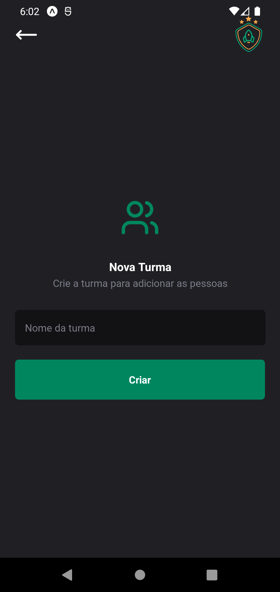
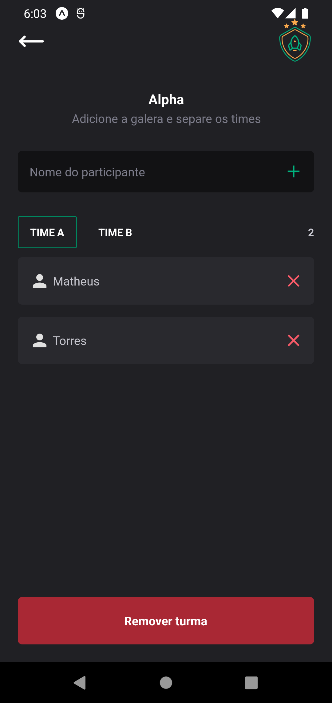

# 📱 TEAMS

O **Teams** é uma aplicação desenvolvida com **Expo Router** e **React Native**, utilizando **TypeScript** e **Tailwind CSS** para estilização.  

A principal proposta do projeto é permitir que os usuários:  
- Cadastrem equipes.  
- Cadastrem usuários dentro das equipes.  
- Naveguem entre as telas usando **rotas dinâmicas** com o Expo Router.  
- Persistam dados localmente com **Async Storage**.    

A interface é estilizada com **NativeWind**, destacando boas práticas de organização.  

---

## ✨ Tecnologias Utilizadas  

- **React Native**  
- **Expo Router**  
- **TypeScript**  
- **Tailwind CSS** (para estilização)  
- **Async Storage** (para persistência de dados local)  
- **Biome.js** (para análise estática de código e formatação)  
---

## 📸 Imagens de Exemplo  

 

  

  


---

## ⚙️ Pré-requisitos  

- **Node.js** instalado.  
- Para rodar no smartphone:  
  - Instale o aplicativo **Expo Go**.  
- Para rodar no computador:  
  - Use um emulador Android (recomendado).  

---

## 🚀 Instalação e Execução  

1. Clone este repositório:  
   ```bash
   git clone https://github.com/seu-usuario/seu-repositorio.git
   cd seu-repositorio

2. Instale as dependências:

npm install

3. Inicie o servidor do Expo:

npx expo start -c